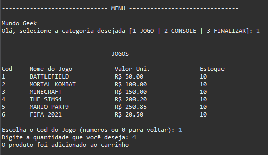
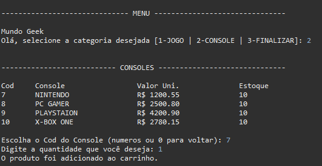
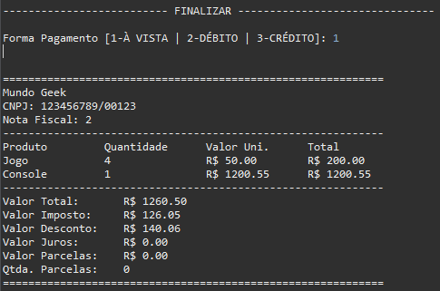

<h1 align="center">PROJETO ECOMMERCE GAMES - GENERATION</h1>
<p align="center">Concluído :rocket: </p>
<p align="center">
  <a href="#Sobre">Sobre</a> •
  <a href="#Funcionalidades">Funcionalidades</a> •
  <a href="#Executar">Como Executar</a> •
  <a href="#Tecnologias">Tecnologias</a> •
  <a href="#Integrantes">Integrantes</a> •
  <a href="#Autor">Autor</a> •
  <a href="#Licenca">Licença</a>
</p>

<h2 id="Sobre">:computer: Sobre o projeto</h2>
<p>
  📦 PROJETO ECOMMERCE GAMES - GENERATION: Uma loja virtual voltado especialmente para os gamers. Nessa loja você pode comprar diversos produtos deste fantástico mundo de aventura dos jogos.  
</p>

<p>
  Esse projeto foi sugerido pelo instrutor <a href="https://www.linkedin.com/in/ednilson-nascimento-41747013/">Ednilson Nascimento</a> para que os alunos pudessem práticar todo o conhecimento ensinado no módulo 1 do curso da <a href="https://brazil.generation.org/">Generation Brasil</a> 
</p>

<h2 id="Funcionalidades">⚙️ Funcionalidades</h2>

  - [x] Navegar por categorias dos produtos
  - [x] Colocar produtos no carrinho
  - [x] Finalizar compra
  - [x] Emitir nota fiscal

<p>Tabela de preços dos jogos:</p>


<p>Tabela de preços dos consoles:</p>


<p>Tela para finalizar a compra:</p>


<h2 id="Executar">🚀 Como executar o projeto</h2>
<h3>Requisitos</h3>
<ul>
  <li>Java 15</li>
  <li>Git</li>
</ul>
<h3>Etapas para executar</h3>

```bash

# Clone este repositório
$ git clone https://github.com/Anderson815/PROJETO_BLOCO1

# Acesse a pasta do projeto no terminal/cmd
$ cd PROJETO_BLOCO1

# Vá para a pasta dist
$ cd dist

# Execute a aplicação no terminal
$ java -jar ecommerce.jar

```


<h2 id="Tecnologias">🛠 Tecnologias</h2>

<a href="https://www.java.com/pt-BR/"></a>

<p>Utilitários:</p>
<a href="https://git-scm.com/"></a>
<a href="https://github.com/"></a>

<h2 id="Integrantes">👨‍💻 Integrantes do Grupo</h2>
<p>Agradeço a toda essa galera aqui que estava junto comigo tentando fazer esse projeto dar certo :) :clap:</p>
<table>
  <tr>
    <td>
      <a href="https://www.linkedin.com/in/bruna-bonif%C3%A1cio-297197208/"></a>  
      <a href="https://www.linkedin.com/in/bruna-bonif%C3%A1cio-297197208/"><p>Bruna Bonifácio</p></a>
    </td>
    <td>
      <a href="https://www.linkedin.com/in/eliabecosta/"></a>
      <a href="https://www.linkedin.com/in/eliabecosta/"><p>Eliabe da Costa</p></a>
    </td> 
    <td>
      <a href="https://www.linkedin.com/in/joao-victor-moura-117832208/"></a>
      <a href="https://www.linkedin.com/in/joao-victor-moura-117832208/"><p>João Victor</p></a>
    </td>
    <td>
      <a href="https://www.linkedin.com/in/kathleen-fidelis-225639195/"></a>
      <a href="https://www.linkedin.com/in/kathleen-fidelis-225639195/"><p>Kathleen Fidelis</p></a>
    </td>
  </tr>
</table>

<h2 id="Autor">🦸 Autor</h2>


<p>
Anderson Correia é um entusiasta e apaixonados por programação, focado em resolver problemas através de códigos.
</p>
<p>Esse projeto foi feito com muito ❤️ e carinho pelo Anderson e os integrantes mencionados 👋🏽 <a href="https://www.linkedin.com/in/anderson-correia/">Entre em contato!</a></p>

<h2 id="Licenca">📝 Licença</h2>

<p>Este projeto esta sobe a licença <a href="https://github.com/Anderson815/PROJETO_BLOCO1/blob/1784a68576d88acac210a292e0cd47e104f8a53e/LICENSE">MIT</a>.</p>
